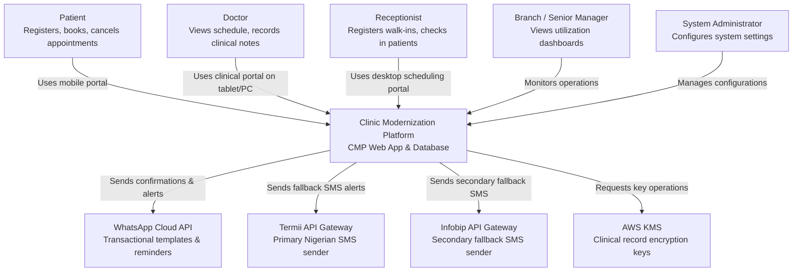
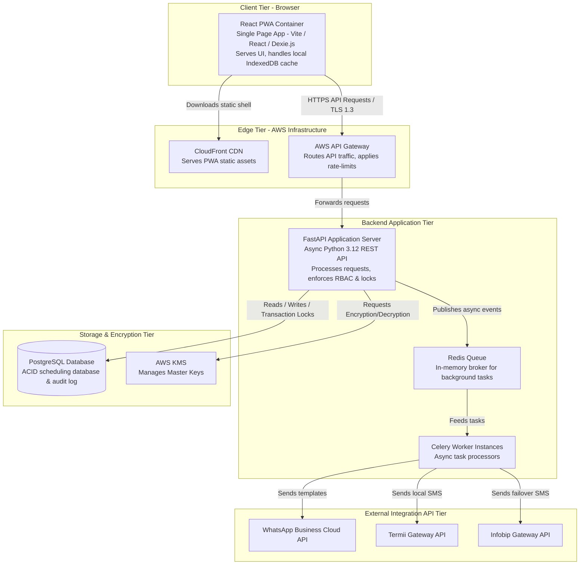
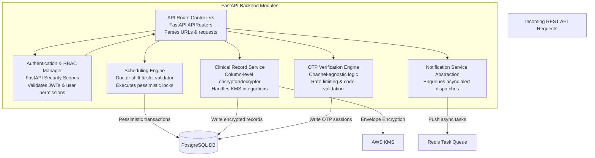
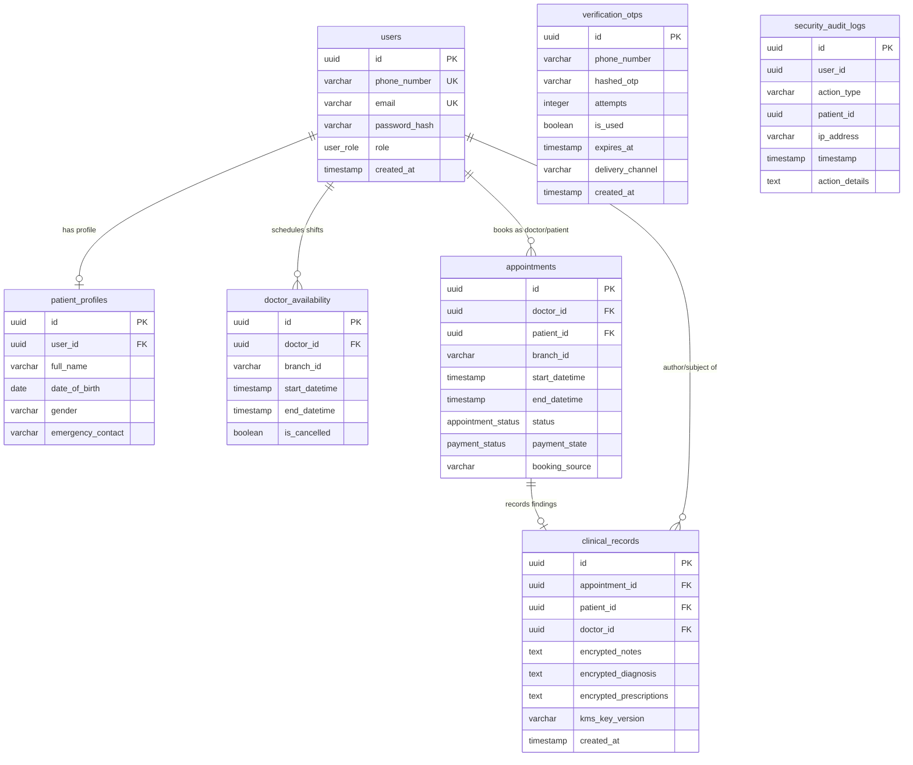

# Clinic Modernization Platform (CMP) — C4 Architecture Models

This document presents the architecture of the Clinic Modernization Platform (CMP) using the **C4 Model** (System Context, Container, Component, and Database Entity-Relationship views) to detail the system boundaries and data flows.

---

## Level 1: System Context Diagram

The System Context diagram shows how the Clinic Modernization Platform (CMP) interacts with users (patients, clinic staff, managers) and external services (messaging gateways, encryption services).

---

## Level 2: Container Diagram

The Container diagram decomposes the CMP into its runtime containers: the static **React PWA** frontend, the **FastAPI** backend API, the **PostgreSQL** database, and the **Redis/Celery** async queue.

---

## Level 3: Component Diagram (FastAPI Backend)

This diagram details the internal modules of the **FastAPI Container** and how they interact to serve requests and execute business logic.

---

## Level 4: Code Diagram (Database Entity-Relationship)

The Database ERD maps the relational structure of the data layer, including constraints and primary/foreign key connections.

