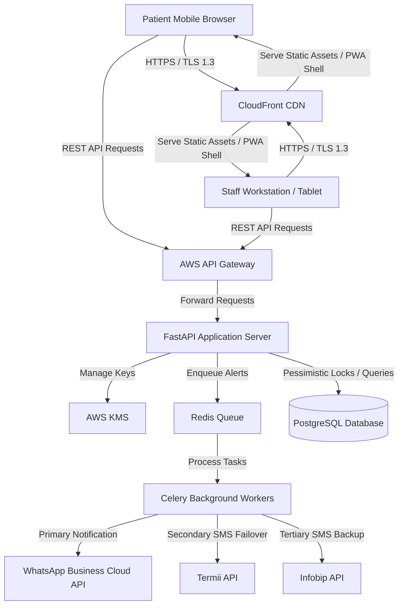
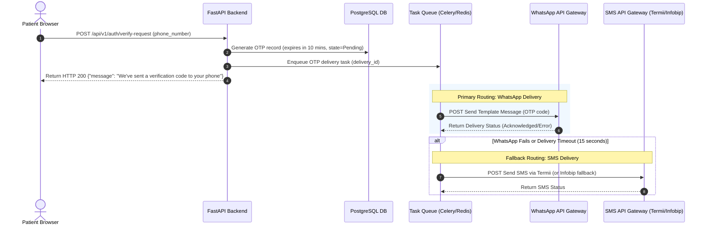

# Clinic Modernization Platform (CMP) — Technical Specification

**Author**: Antigravity (Senior AI Architect)  
**Reviewers**: Clinic Owner, Tech Lead, Security Officer  
**Status**: Draft  
**Date**: 2026-06-04  
**Target release**: Phase 1 MVP (4-Month Timeline)

---

## 1. Summary

The Clinic Modernization Platform (CMP) is a secure, cloud-hosted clinic management system designed to transition a chain of three private healthcare clinics (scaling to 10–15 branches) from manual paper-and-chat workflows to digital operations. The MVP leverages a decoupled frontend/backend structure consisting of a lightweight **Vite + React PWA** frontend, an asynchronous **FastAPI** backend, and a **PostgreSQL** database. 

It guarantees strict data privacy compliance under Nigeria's Data Protection Regulation (NDPR) via application-level column encryption, enforces atomic time-slot scheduling through database pessimistic locks, and ensures high notification delivery rates via a pluggable, multi-gateway failover engine.

---

## 2. Goals and Non-Goals

### 2.1 Goals
* **G-001**: Implement concurrent booking protection (pessimistic locking) to eliminate double-booking permanent and rotating doctors.
* **G-002**: Achieve sub-3.0 second page loads over Nigerian 3G/4G networks through a static Progressive Web App (PWA) shell.
* **G-003**: Provide offline resiliency, caching daily schedules locally on browsers for at least 2 hours of read-only access.
* **G-004**: Encrypt patient medical histories at the application layer to hide clinical records from database and cloud administrators.
* **G-005**: Automate patient check-ins and notification delivery with an abstracted failover chain (WhatsApp -> Termii SMS -> Infobip SMS).

### 2.2 Non-Goals
* **NG-001**: Implementation of real-time video/audio telemedicine consultations.
* **NG-002**: Direct integration of Paystack/Flutterwave billing processors (database models will support payment states, but transaction routing is deferred to Phase 2).
* **NG-003**: Native Android or iOS mobile applications (responsive web app only).
* **NG-004**: Automated clinical diagnosis or treatment recommendations.

---

## 3. Background

The current clinic chain relies on manual paper files and WhatsApp group chats to manage schedules and share patient data. This results in frequent scheduling conflicts, high patient no-show rates (~25–30%), and lack of auditable data access controls. 

Operating in West Africa Time (WAT), the system must account for local constraints:
1. **Network Instability**: Internet connections drop frequently, requiring offline data caching for in-clinic workstations.
2. **DND Restrictions**: Transactional SMS messages are frequently blocked by Nigerian carriers (MTN, Airtel, Glo, 9mobile) unless routed via a domestic gateway with DND-override configurations.
3. **Data Security (NDPR)**: Health records are highly regulated. Database exposure must be mitigated by cryptography.

---

## 4. Design

### 4.1 Architecture Overview

The system is designed as a decoupled Single Page Application (SPA) client communicating with an asynchronous REST API backend.



### 4.2 Data Model

To prevent future schema rewrites, the database schema integrates audit controls, availability shift models, and placeholder columns for Phase 2 payment integration.

```sql
-- Enums
CREATE TYPE user_role AS ENUM ('patient', 'receptionist', 'doctor', 'manager', 'admin', 'executive');
CREATE TYPE appointment_status AS ENUM ('booked', 'cancelled', 'completed', 'no-show');
CREATE TYPE payment_status AS ENUM ('pending', 'deposit_paid', 'fully_paid', 'waived', 'refunded');

-- Users Table (Unencrypted for authentication and routing)
CREATE TABLE users (
    id UUID PRIMARY KEY DEFAULT gen_random_uuid(),
    phone_number VARCHAR(15) UNIQUE NOT NULL,
    email VARCHAR(255) UNIQUE NOT NULL,
    password_hash VARCHAR(255) NOT NULL,
    role user_role NOT NULL,
    created_at TIMESTAMP WITH TIME ZONE DEFAULT CURRENT_TIMESTAMP,
    updated_at TIMESTAMP WITH TIME ZONE DEFAULT CURRENT_TIMESTAMP
);

-- Profiles Table (Confidential Data - NDPR Protected)
CREATE TABLE patient_profiles (
    id UUID PRIMARY KEY DEFAULT gen_random_uuid(),
    user_id UUID REFERENCES users(id) ON DELETE CASCADE,
    full_name VARCHAR(255) NOT NULL,
    date_of_birth DATE NOT NULL,
    gender VARCHAR(10),
    emergency_contact VARCHAR(255),
    created_at TIMESTAMP WITH TIME ZONE DEFAULT CURRENT_TIMESTAMP
);

-- Doctor Shifts (FR-018: Time-bound availability blocks)
CREATE TABLE doctor_availability (
    id UUID PRIMARY KEY DEFAULT gen_random_uuid(),
    doctor_id UUID REFERENCES users(id) ON DELETE CASCADE,
    branch_id VARCHAR(50) NOT NULL,
    start_datetime TIMESTAMP WITH TIME ZONE NOT NULL,
    end_datetime TIMESTAMP WITH TIME ZONE NOT NULL,
    is_cancelled BOOLEAN DEFAULT FALSE,
    created_at TIMESTAMP WITH TIME ZONE DEFAULT CURRENT_TIMESTAMP,
    CONSTRAINT check_dates CHECK (start_datetime < end_datetime)
);

-- Appointments Table
CREATE TABLE appointments (
    id UUID PRIMARY KEY DEFAULT gen_random_uuid(),
    doctor_id UUID REFERENCES users(id) ON DELETE RESTRICT,
    patient_id UUID REFERENCES users(id) ON DELETE RESTRICT,
    branch_id VARCHAR(50) NOT NULL,
    start_datetime TIMESTAMP WITH TIME ZONE NOT NULL,
    end_datetime TIMESTAMP WITH TIME ZONE NOT NULL,
    status appointment_status DEFAULT 'booked',
    payment_state payment_status DEFAULT 'pending', -- INT-005 Compatibility
    booking_source VARCHAR(50) NOT NULL, -- 'patient', 'receptionist', 'admin_override'
    created_at TIMESTAMP WITH TIME ZONE DEFAULT CURRENT_TIMESTAMP,
    updated_at TIMESTAMP WITH TIME ZONE DEFAULT CURRENT_TIMESTAMP,
    CONSTRAINT check_app_dates CHECK (start_datetime < end_datetime)
);

-- Clinical Records Table (Restricted Medical - Encrypted columns)
CREATE TABLE clinical_records (
    id UUID PRIMARY KEY DEFAULT gen_random_uuid(),
    appointment_id UUID UNIQUE REFERENCES appointments(id) ON DELETE RESTRICT,
    patient_id UUID REFERENCES users(id) ON DELETE RESTRICT,
    doctor_id UUID REFERENCES users(id) ON DELETE RESTRICT,
    encrypted_notes TEXT NOT NULL,       -- Encrypted via AES-256-GCM (Ciphertext + IV + Tag)
    encrypted_diagnosis TEXT NOT NULL,   -- Encrypted via AES-256-GCM
    encrypted_prescriptions TEXT NOT NULL, -- Encrypted via AES-256-GCM
    kms_key_version VARCHAR(100) NOT NULL,
    created_at TIMESTAMP WITH TIME ZONE DEFAULT CURRENT_TIMESTAMP
);

-- Immutable Security Audit Logs (NFR-007)
CREATE TABLE security_audit_logs (
    id UUID PRIMARY KEY DEFAULT gen_random_uuid(),
    user_id UUID NOT NULL,
    action_type VARCHAR(100) NOT NULL, -- 'READ_CLINICAL_RECORD', 'OVERRIDE_BOOKING', etc.
    patient_id UUID NOT NULL,
    ip_address VARCHAR(45) NOT NULL,
    timestamp TIMESTAMP WITH TIME ZONE DEFAULT CURRENT_TIMESTAMP,
    action_details TEXT NOT NULL
);

-- Verification OTPs Table (Channel-Agnostic Verification)
CREATE TABLE verification_otps (
    id UUID PRIMARY KEY DEFAULT gen_random_uuid(),
    phone_number VARCHAR(15) NOT NULL,
    hashed_otp VARCHAR(255) NOT NULL,            -- Encoded/hashed OTP code to prevent DB leak compromise
    attempts INTEGER DEFAULT 0,                 -- Tracking failed retry attempts
    is_used BOOLEAN DEFAULT FALSE,
    expires_at TIMESTAMP WITH TIME ZONE NOT NULL,
    delivery_channel VARCHAR(20) NOT NULL,       -- 'whatsapp' or 'sms'
    created_at TIMESTAMP WITH TIME ZONE DEFAULT CURRENT_TIMESTAMP
);
```

#### Booking Concurrency & Validation (FR-019)
To prevent race conditions during concurrent bookings, the API server will open a transaction and execute a database-level pessimistic lock:

```python
# Pseudo-code representation of backend transactional lock validation
async def create_booking(db, booking_data):
    async with db.begin():
        # 1. Lock the doctor's shifts overlapping the target time block
        shift = await db.execute(
            select(DoctorAvailability)
            .filter(
                DoctorAvailability.doctor_id == booking_data.doctor_id,
                DoctorAvailability.start_datetime <= booking_data.start_datetime,
                DoctorAvailability.end_datetime >= booking_data.end_datetime,
                DoctorAvailability.is_cancelled == False
            )
            .with_for_update() # Pessimistic row locking
        )
        if not shift.first():
            raise HTTPException(status_code=400, detail="Doctor is not available at this time.")

        # 2. Check for conflicting appointments
        conflict = await db.execute(
            select(Appointments)
            .filter(
                Appointments.doctor_id == booking_data.doctor_id,
                Appointments.status == 'booked',
                Appointments.start_datetime < booking_data.end_datetime,
                Appointments.end_datetime > booking_data.start_datetime
            )
            .with_for_update() # Lock conflicting rows to prevent concurrent insertion
        )
        if conflict.first():
            raise HTTPException(status_code=409, detail="Slot is no longer available.")

        # 3. Insert new appointment
        new_appointment = Appointment(**booking_data)
        db.add(new_appointment)
        return new_appointment
```

### 4.3 API Changes

#### Post Booking
* **Endpoint**: `POST /api/v1/appointments`
* **Access**: Authenticated (`patient`, `receptionist`, `manager`)
* **Request Schema**:
  ```json
  {
    "doctor_id": "9b1deb4d-3b7d-4bad-9bdd-2b0d7b3dcb6d",
    "branch_id": "branch-lekki",
    "start_datetime": "2026-06-05T09:00:00+01:00",
    "end_datetime": "2026-06-05T09:30:00+01:00",
    "booking_source": "patient"
  }
  ```
* **Response (Success - 201 Created)**:
  ```json
  {
    "appointment_id": "4392f2c8-888d-4f11-827c-31c15f91fb34",
    "status": "booked",
    "payment_state": "pending"
  }
  ```

#### Post Clinical Notes
* **Endpoint**: `POST /api/v1/clinical-records`
* **Access**: Restricted (`doctor` only)
* **Request Schema**:
  ```json
  {
    "appointment_id": "4392f2c8-888d-4f11-827c-31c15f91fb34",
    "patient_id": "78e907d8-5cfb-4e89-85ab-234b2f2dcb6d",
    "notes": "Patient reports mild chest tightness after exercise...",
    "diagnosis": "Exercise-induced bronchospasm",
    "prescriptions": "Albuterol Inhaler, 2 puffs as needed"
  }
  ```
* **Response (Success - 201 Created)**:
  ```json
  {
    "record_id": "18f9cf08-724d-4b82-bc10-c4e85d1e67fa",
    "status": "encrypted_and_stored"
  }
  ```

### 4.4 Key Design Decisions

1. **PostgreSQL as Primary Datastore** ([ADR-001](file:///C:/Users/DELL/Documents/Project/clinic_app/adr-001-postgresql-primary-datastore.md)): Relational integrity and explicit pessimistic locks prevent appointment conflicts and double-booking during spikes in scheduling requests.
2. **Vite + React SPA PWA** ([ADR-002](file:///C:/Users/DELL/Documents/Project/clinic_app/adr-002-react-pwa-client.md)): Decoupled static client ensures fast loading times over mobile connections and registers Service Workers caching data in the IndexedDB browser storage during ISP dropouts.
3. **Application-Level Encryption** ([ADR-003](file:///C:/Users/DELL/Documents/Project/clinic_app/adr-003-application-level-column-encryption.md)): Sensitive parameters (`notes`, `diagnosis`, `prescriptions`) are encrypted using AES-256-GCM in the backend. AWS KMS holds the wrapping key. System/database administrators cannot view patient clinical details.
4. **Pluggable Strategy-Based Notification Failover** ([ADR-004](file:///C:/Users/DELL/Documents/Project/clinic_app/adr-004-pluggable-notification-failover.md)): Decouples integration logic. If a primary WhatsApp or Termii notification fails, background task managers route the alert to fallback APIs automatically.

### 4.5 Failure Modes

| Failure Mode | System Response | Recovery Path |
|---|---|---|
| **Database Lock Contention** | Transaction times out after 3.0s; returns HTTP 409 (Conflict). | Client prompts the user to select another slot or retry, mitigating deadlock. |
| **Offline Transition** | Browser detects disconnection, triggers offline banner; blocks writes. | Dashboard loads current day's list from IndexedDB cache locally (read-only for 2h). |
| **WhatsApp API Offline** | Background task catches connection error, logs failure, changes status to "failed". | The failover worker immediately dequeues the task and sends the SMS template via Termii instead. |
| **AWS KMS Unavailable** | API returns HTTP 503; block creation/reads of encrypted notes. | API tries secondary cache or locks record creation temporarily; clinical notes are never saved in plaintext. |

### 4.6 Hierarchical Verification & OTP Delivery Flow

To verify patient identities during registration and authentication, the system implements a **Channel-Agnostic Verification Engine**. This engine abstracts the physical transmission logic from the core OTP generation state machine, enabling multi-channel delivery strategies (WhatsApp-first with automatic SMS fallback).

#### 4.6.1 Delivery Workflow



#### 4.6.2 Business Logic & Routing Policies
1. **WhatsApp-First Routing**: The system triggers verification alerts via the WhatsApp Business Cloud API.
2. **Automated SMS Fallback**: A task worker monitors the WhatsApp delivery status. If the WhatsApp message returns an error, if the destination number is not registered on WhatsApp, or if a delivery confirmation webhook is not received within **15 seconds** (configurable between 10-20s), the engine automatically fires the OTP via **Termii SMS** (or **Infobip** as a backup).
3. **UX Channel Abstraction**: The client UI remains channel-agnostic. It displays: `"We've sent a verification code to your phone."` hiding intermediate delivery transitions from patients.
4. **Active Session Tracking**: Only **one active OTP session** is permitted per phone number. A new OTP generation request invalidates all previously generated active codes for that number, preventing race conditions or dual-channel confusion.
5. **Security Constraints**:
   * **OTP Expiry**: Generated codes expire strictly after **10 minutes**.
   * **Single-Use**: Once a code is validated, it is flagged as `is_used = TRUE` and cannot be recycled.
   * **Rate Limiting**: IP and phone-number based rate limits (max 3 verification requests per phone number in 15 minutes) prevent SMS/WhatsApp spam and denial-of-wallet attacks.
   * **Retry Limits**: A maximum of 5 verification attempts are allowed per code. Exceeding this invalidates the OTP block and locks the session.
6. **Cost Optimization**: WhatsApp templates are billed per conversation, whereas SMS costs are per message segment. Prioritizing WhatsApp reduces expected messaging costs by an estimated 70-90% based on WhatsApp's high penetration rates in Nigeria.

---

## 5. Security Considerations

* **Role-Based Access Control (RBAC)**: Enforced via FastAPI security scopes. JWT tokens contain the user's role.
* **AWS KMS Key Policies**: Key access control is enforced via standard AWS KMS Key Policies. The KMS key policy explicitly restricts key actions (e.g., `kms:Decrypt` and `kms:Encrypt`) to the IAM role assigned to the backend application server instances. System and database administrators (even those with root IAM admin roles) are explicitly denied decrypt permissions on the key, securing clinical notes at rest.
* **Separation of Clinical Data (NFR-008)**: Administrators are granted system admin scopes allowing them to perform DB maintenance, but because they do not have IAM policies or KMS key policy permissions allowing Decrypt operations, they are cryptographically locked out from clinical logs.
* **Immutable Audit Trail**: Writing to clinical records automatically generates a non-nullable record in the `security_audit_logs` table within the same PostgreSQL transaction.
* **TLS 1.3**: All incoming client communication is locked to TLS 1.3 in transit.

---

## 6. Observability

* **Structured Logging**: All backend outputs use structured JSON logs containing a generated `correlation_id` header to trace API requests across background queues and database queries.
* **Search Latency Target**: Database query durations are logged to Datadog/CloudWatch; alarms trigger if search queries exceed 2.0s (NFR-001).
* **Delivery Logging**: The `NotificationLog` monitors notification metrics, calculating latency from appointment creation to notification delivery.

---

## 7. Rollout Plan

1. **Database Migration**: Schema creation using Alembic, executing backward-compatible modifications (e.g., adding nullable columns first, then populating values, and finally applying non-null constraints).
2. **PWA Rollout**: Static shell hosted on AWS S3/CloudFront behind a staging DNS domain.
3. **Phased Clinic Rollout**:
   * Week 1: Rollout system at Branch A (pilot branch).
   * Week 3: Rollout at Branch B.
   * Week 5: Rollout at Branch C.
4. **Offline Cache Validation**: Verify Service Worker routing rules during simulated workstation disconnections.

---

## 8. Resolved Decisions

| Question | Resolution | Decision Date | Architectural Impact |
|---|---|---|---|
| **OQ-001**: KMS Access Policies | Enforced via **standard AWS KMS Key Policies** scoped directly to the backend application server's IAM role. | 2026-06-04 | Simplifies deployment and local mock key testing. |
| **OQ-002**: OTP Route Channel | Implemented as a **hierarchical, WhatsApp-first verification flow** with automated **SMS fallback** (via Termii) on a 15-second delivery window timeout. | 2026-06-04 | Decreases SMS consumption costs while maintaining high-reliability delivery. |
