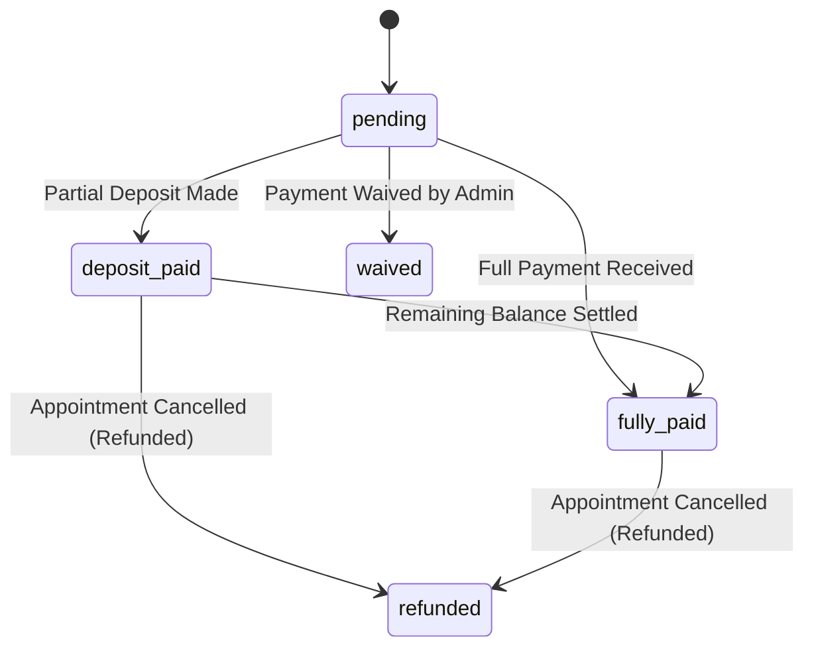
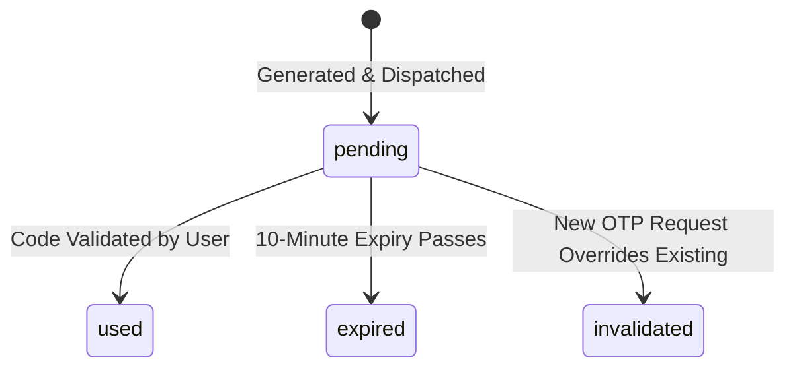

# Data Model Specification: Core Architecture

## Entities and Schema

### 1. User (`users`)
Represents system users with authenticated credentials and system-wide roles.
* **Fields**:
  * `id`: `UUID` (Primary Key, default: `gen_random_uuid()`)
  * `phone_number`: `VARCHAR(15)` (Unique, Not Null)
  * `email`: `VARCHAR(255)` (Unique, Not Null)
  * `password_hash`: `VARCHAR(255)` (Not Null)
  * `role`: `user_role` (Enum: `patient`, `receptionist`, `doctor`, `manager`, `admin`, `executive`)
  * `created_at`: `TIMESTAMP WITH TIME ZONE` (Default: `CURRENT_TIMESTAMP`)
  * `updated_at`: `TIMESTAMP WITH TIME ZONE` (Default: `CURRENT_TIMESTAMP`)
* **Validations**:
  * Phone number must match standard international format (e.g., Nigerian +234 prefix or domestic 10-11 digits).
  * Email must be a valid email format.

### 2. Patient Profile (`patient_profiles`)
Confidential patient demographic details protected under NDPR rules.
* **Fields**:
  * `id`: `UUID` (Primary Key)
  * `user_id`: `UUID` (Foreign Key referencing `users(id)`, cascade on delete)
  * `full_name`: `VARCHAR(255)` (Not Null)
  * `date_of_birth`: `DATE` (Not Null)
  * `gender`: `VARCHAR(10)`
  * `emergency_contact`: `VARCHAR(255)`
  * `created_at`: `TIMESTAMP WITH TIME ZONE` (Default: `CURRENT_TIMESTAMP`)

### 3. Doctor Availability (`doctor_availability`)
Defines time-bound availability shifts for rotating and permanent doctors.
* **Fields**:
  * `id`: `UUID` (Primary Key)
  * `doctor_id`: `UUID` (Foreign Key referencing `users(id)`, cascade on delete)
  * `branch_id`: `VARCHAR(50)` (Not Null)
  * `start_datetime`: `TIMESTAMP WITH TIME ZONE` (Not Null)
  * `end_datetime`: `TIMESTAMP WITH TIME ZONE` (Not Null)
  * `is_cancelled`: `BOOLEAN` (Default: `FALSE`)
  * `created_at`: `TIMESTAMP WITH TIME ZONE` (Default: `CURRENT_TIMESTAMP`)
* **Constraints**:
  * `start_datetime < end_datetime`

### 4. Appointment (`appointments`)
Tracks scheduling metadata, branch locations, and transaction states.
* **Fields**:
  * `id`: `UUID` (Primary Key)
  * `doctor_id`: `UUID` (Foreign Key referencing `users(id)`, restrict on delete)
  * `patient_id`: `UUID` (Foreign Key referencing `users(id)`, restrict on delete)
  * `branch_id`: `VARCHAR(50)` (Not Null)
  * `start_datetime`: `TIMESTAMP WITH TIME ZONE` (Not Null)
  * `end_datetime`: `TIMESTAMP WITH TIME ZONE` (Not Null)
  * `status`: `appointment_status` (Enum, default: `booked`)
  * `payment_state`: `payment_status` (Enum, default: `pending`)
  * `booking_source`: `VARCHAR(50)` (Not Null, e.g., `patient`, `receptionist`, `admin_override`)
  * `created_at`: `TIMESTAMP WITH TIME ZONE` (Default: `CURRENT_TIMESTAMP`)
  * `updated_at`: `TIMESTAMP WITH TIME ZONE` (Default: `CURRENT_TIMESTAMP`)
* **Constraints**:
  * `start_datetime < end_datetime`

### 5. Clinical Record (`clinical_records`)
Restricted medical notes encrypted in application memory space prior to persistence.
* **Fields**:
  * `id`: `UUID` (Primary Key)
  * `appointment_id`: `UUID` (Unique, Foreign Key referencing `appointments(id)`, restrict on delete)
  * `patient_id`: `UUID` (Foreign Key referencing `users(id)`, restrict on delete)
  * `doctor_id`: `UUID` (Foreign Key referencing `users(id)`, restrict on delete)
  * `encrypted_notes`: `TEXT` (AES-256-GCM ciphertext + IV + auth tag, Not Null)
  * `encrypted_diagnosis`: `TEXT` (AES-256-GCM ciphertext + IV + auth tag, Not Null)
  * `encrypted_prescriptions`: `TEXT` (AES-256-GCM ciphertext + IV + auth tag, Not Null)
  * `kms_key_version`: `VARCHAR(100)` (Not Null)
  * `created_at`: `TIMESTAMP WITH TIME ZONE` (Default: `CURRENT_TIMESTAMP`)

### 6. Security Audit Log (`security_audit_logs`)
Immutable audit log tracking access to sensitive clinical data.
* **Fields**:
  * `id`: `UUID` (Primary Key)
  * `user_id`: `UUID` (Not Null)
  * `action_type`: `VARCHAR(100)` (Not Null, e.g., `READ_CLINICAL_RECORD`)
  * `patient_id`: `UUID` (Not Null)
  * `ip_address`: `VARCHAR(45)` (Not Null)
  * `timestamp`: `TIMESTAMP WITH TIME ZONE` (Default: `CURRENT_TIMESTAMP`)
  * `action_details`: `TEXT` (Not Null)

### 7. Verification OTP (`verification_otps`)
Stores one-time passwords for phone verification.
* **Fields**:
  * `id`: `UUID` (Primary Key)
  * `phone_number`: `VARCHAR(15)` (Not Null)
  * `hashed_otp`: `VARCHAR(255)` (Not Null)
  * `attempts`: `INTEGER` (Default: `0`)
  * `is_used`: `BOOLEAN` (Default: `FALSE`)
  * `expires_at`: `TIMESTAMP WITH TIME ZONE` (Not Null)
  * `delivery_channel`: `VARCHAR(20)` (Not Null, e.g., `whatsapp`, `sms`)
  * `created_at`: `TIMESTAMP WITH TIME ZONE` (Default: `CURRENT_TIMESTAMP`)

---

## State Transitions

### 1. Appointment Status
```mermaid
stateDiagram-v2
    [*] --> booked : Slot Created
    booked --> completed : Doctor Session Concluded
    booked --> cancelled : Patient/Staff Cancellation
    booked --> no-show : Appointment Time Passes Unattended
```

### 2. Appointment Payment Status (Phase 2 Compatibility)


### 3. Verification OTP

