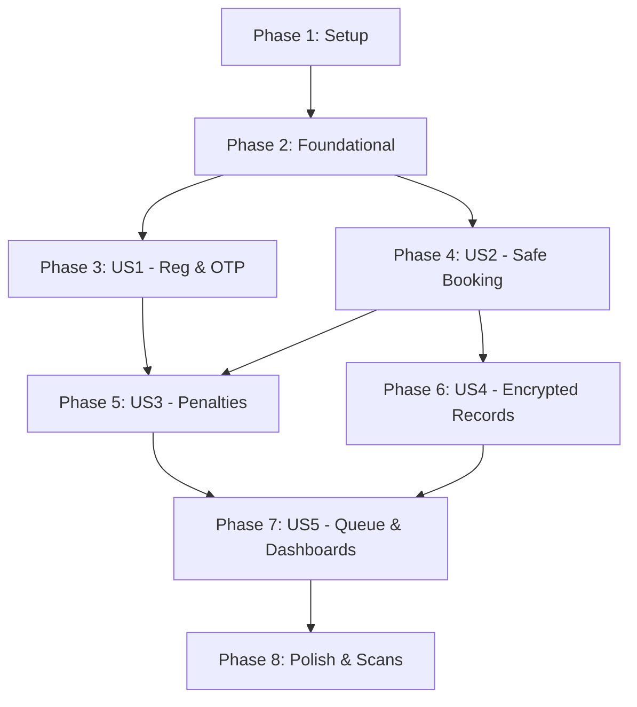

# Tasks: Core Architecture Setup

**Input**: Design documents from `/specs/001-core-architecture/`

**Prerequisites**: plan.md (required), spec.md (required for user stories), research.md, data-model.md, contracts/

**Tests**: Tests are MANDATORY for all features. Implementations must include contract, integration, and unit tests as part of the core deliverables.

**Organization**: Tasks are grouped by user story to enable independent implementation and testing of each story.

## Format: `[ID] [P?] [Story] Description`
* **[P]**: Can run in parallel (different files, no dependencies)
* **[Story]**: Which user story this task belongs to (e.g., US1, US2, US3)
* Include exact file paths in descriptions

---

## Phase 1: Setup (Shared Infrastructure)

**Purpose**: Project initialization and basic structure

- [ ] T001 Create project structure for backend/ and frontend/ per implementation plan
- [ ] T002 Initialize FastAPI Python project and configure virtual env in backend/
- [ ] T003 Initialize React PWA project using Vite and TypeScript in frontend/
- [ ] T004 [P] Configure linting and formatting tools (ruff/flake8 for backend, eslint/prettier for frontend)

---

## Phase 2: Foundational (Blocking Prerequisites)

**Purpose**: Core infrastructure that MUST be complete before ANY user story can be implemented

**⚠️ CRITICAL**: No user story work can begin until this phase is complete

- [ ] T005 Setup database connection pool and SQLAlchemy/SQLModel configuration in backend/src/core/database.py
- [ ] T006 Configure Alembic database migration environment in backend/alembic/
- [ ] T007 [P] Implement base user and profile database schemas in backend/src/models/user.py
- [ ] T008 [P] Setup JWT authentication and password hashing utilities in backend/src/core/auth.py
- [ ] T009 [P] Create the Strategy-based base NotificationService interface in backend/src/services/notifications.py
- [ ] T010 [P] Configure Celery/Redis task queue for background workers in backend/src/core/queue.py
- [ ] T011 Initialize Dexie.js local database schema and synchronization client in frontend/src/services/db.ts
- [ ] T012 Configure API fetch client with base headers and credentials in frontend/src/services/api.ts

**Checkpoint**: Foundation ready - user story implementation can now begin

---

## Phase 3: User Story 1 - Patient Registration & OTP Verification (Priority: P1)

**Goal**: Allow patients to sign up and verify their accounts using a WhatsApp-first delivery with automated SMS fallback.

**Independent Test**: Register a patient via frontend UI, confirm OTP task is enqueued, verify WhatsApp/Termii fallback triggers correctly, and submit validation code to login.

### Tests for User Story 1 (MANDATORY) ⚠️
> **NOTE: Write these tests FIRST, ensure they FAIL before implementation**
- [ ] T013 [P] [US1] Create registration API contract tests in backend/tests/contract/test_auth.py
- [ ] T014 [P] [US1] Create OTP generation and verification unit tests in backend/tests/unit/test_otp.py
- [ ] T015 [US1] Create WhatsApp-first with SMS fallback integration tests in backend/tests/integration/test_otp_failover.py

### Implementation for User Story 1
- [ ] T016 [P] [US1] Implement verification OTP model and database schema in backend/src/models/otp.py
- [ ] T017 [P] [US1] Implement WhatsApp Cloud API client adapter in backend/src/services/whatsapp.py
- [ ] T018 [P] [US1] Implement Termii SMS client adapter in backend/src/services/termii.py
- [ ] T019 [P] [US1] Implement Infobip SMS client adapter in backend/src/services/infobip.py
- [ ] T020 [US1] Implement OTP dispatch worker executing delivery failover in backend/src/core/queue.py
- [ ] T021 [US1] Implement patient registration and validation endpoints in backend/src/api/auth.py
- [ ] T022 [P] [US1] Build patient registration and signup screen in frontend/src/pages/Register.tsx
- [ ] T023 [P] [US1] Build OTP code verification screen in frontend/src/pages/VerifyOTP.tsx
- [ ] T024 [US1] Integrate authentication state store and routers in frontend/src/main.tsx

**Checkpoint**: User Story 1 is fully functional and testable independently

---

## Phase 4: User Story 2 - Concurrency-Safe Appointment Booking (Priority: P1)

**Goal**: Support scheduling doctor shifts and booking slots with database-level pessimistic locking to prevent duplicate slots.

**Independent Test**: Run concurrent booking scripts attempting to reserve the exact same slot; verify that only the first succeeds while the second fails with a 409 error.

### Tests for User Story 2 (MANDATORY) ⚠️
- [ ] T025 [P] [US2] Create appointment booking API contract tests in backend/tests/contract/test_appointments.py
- [ ] T026 [P] [US2] Create doctor availability shift validation unit tests in backend/tests/unit/test_availability.py
- [ ] T027 [US2] Create concurrent booking race-condition integration tests in backend/tests/integration/test_booking_concurrency.py

### Implementation for User Story 2
- [ ] T028 [P] [US2] Create doctor availability shift and appointment schemas in backend/src/models/scheduling.py
- [ ] T029 [US2] Implement pessimistic locking booking validation transaction in backend/src/services/booking.py
- [ ] T030 [US2] Implement doctor shift availability and booking API endpoints in backend/src/api/appointments.py
- [ ] T031 [P] [US2] Build responsive appointment booking UI for patients in frontend/src/pages/BookAppointment.tsx
- [ ] T032 [P] [US2] Build receptionist dashboard for managing patient slots in frontend/src/pages/ReceptionistDashboard.tsx
- [ ] T033 [US2] Configure Workbox service worker caching to support 2-hour offline read-only Dashboard access in frontend/src/service-worker.ts

**Checkpoint**: User Story 2 is fully functional and testable independently

---

## Phase 5: User Story 3 - Cancellation Rules & Penalty Overrides (Priority: P2)

**Goal**: Manage progressive late-cancellation warning alerts, penalty soft flagging, and booking restriction blocks.

**Independent Test**: Cancel an appointment less than 2 hours before the start time, verify late warning penalty log increases, and verify booking self-service blocks upon 4 violations.

### Tests for User Story 3 (MANDATORY) ⚠️
- [ ] T034 [P] [US3] Create cancellation penalty logic unit tests in backend/tests/unit/test_penalties.py
- [ ] T035 [US3] Create booking restriction enforcement and admin override integration tests in backend/tests/integration/test_restrictions.py

### Implementation for User Story 3
- [ ] T036 [US3] Implement progressive cancellation rules (FR-012, FR-013, FR-014) logic in backend/src/services/penalties.py
- [ ] T037 [US3] Implement emergency and clinic-initiated cancellation exemption scopes in backend/src/api/appointments.py
- [ ] T038 [US3] Implement doctor shift cancellation revalidation and conflict triggers in backend/src/services/revalidation.py
- [ ] T039 [P] [US3] Build late-cancellation warning popups and restrictions blocker UI in frontend/src/components/CancellationModal.tsx
- [ ] T040 [US3] Implement receptionist restriction override control elements in frontend/src/pages/ReceptionistDashboard.tsx

**Checkpoint**: User Story 3 is fully functional and testable independently

---

## Phase 6: User Story 4 - Secure Clinical Consultation Records (Priority: P1)

**Goal**: Secure patient clinical notes at rest using AES-256-GCM application-level encryption integrated with AWS KMS key policies.

**Independent Test**: Insert a clinical record, verify the database values are encrypted ciphertext strings, and verify system admin roles are blocked from reading plaintext.

### Tests for User Story 4 (MANDATORY) ⚠️
- [ ] T041 [P] [US4] Create clinical record API contract tests in backend/tests/contract/test_clinical_records.py
- [ ] T042 [P] [US4] Create AES-256-GCM encryption and KMS envelope decryption unit tests in backend/tests/unit/test_cryptography.py
- [ ] T043 [US4] Create role-based clinical records access and audit logging integration tests in backend/tests/integration/test_clinical_access.py

### Implementation for User Story 4
- [ ] T044 [P] [US4] Implement clinical records and security audit logs schemas in backend/src/models/medical.py
- [ ] T045 [P] [US4] Setup AWS KMS client integration with local envelope encryption DEK cache in backend/src/core/kms.py
- [ ] T046 [US4] Implement Custom SQLAlchemy EncryptedColumn field type in backend/src/core/fields.py
- [ ] T047 [US4] Implement clinical records create/retrieve API endpoints and audit trail logging in backend/src/api/clinical.py
- [ ] T048 [P] [US4] Build tablet-optimized Doctor consultation workspace UI in frontend/src/pages/DoctorDashboard.tsx
- [ ] T049 [US4] Build controlled laboratory results release control UI in frontend/src/pages/DoctorDashboard.tsx

**Checkpoint**: User Story 4 is fully functional and testable independently

---

## Phase 7: User Story 5 - Front Desk Queue and Management Dashboards (Priority: P2)

**Goal**: Support front-desk patient arrival check-in and display real-time single-branch / consolidated reports.

**Independent Test**: Mark a patient checked-in; verify the doctor's dashboard receives the arrival event and the managers' dashboard updates metrics.

### Tests for User Story 5 (MANDATORY) ⚠️
- [ ] T050 [P] [US5] Create patient check-in API unit tests in backend/tests/unit/test_checkin.py
- [ ] T051 [US5] Create operational reports dashboard metrics generation integration tests in backend/tests/integration/test_reports.py

### Implementation for User Story 5
- [ ] T052 [US5] Implement patient check-in endpoint (FR-010) in backend/src/api/appointments.py
- [ ] T053 [US5] Implement branch-specific and consolidated cross-branch report query APIs in backend/src/api/reports.py
- [ ] T054 [P] [US5] Add patient check-in and active queue board UI in frontend/src/pages/ReceptionistDashboard.tsx
- [ ] T055 [P] [US5] Build metrics report visualization dashboards for Managers and Executives in frontend/src/pages/ManagerDashboard.tsx

**Checkpoint**: User Story 5 is fully functional and testable independently

---

## Phase 8: Polish & Cross-Cutting Concerns

**Purpose**: Improvements that affect multiple user stories

- [ ] T056 [P] Add database query performance indexes for search latency tuning in backend/alembic/migrations/
- [ ] T057 Run package security scans (safety, bandit, npm audit) and resolve vulnerabilities
- [ ] T058 [P] Document API endpoints using OpenAPI/Swagger annotations in backend/src/main.py
- [ ] T059 Run Playwright browser tests in simulated offline mode to validate 2-hour PWA local cache performance

---

## Dependencies & Execution Order

### Phase Dependencies



* **Setup (Phase 1)**: No dependencies - starts immediately.
* **Foundational (Phase 2)**: Depends on Setup completion. Blocks all user stories.
* **User Stories (Phases 3-7)**:
  * **User Story 1 (P1)**: Depends on Foundational. Independent of other stories.
  * **User Story 2 (P1)**: Depends on Foundational. Independent of other stories.
  * **User Story 3 (P2)**: Depends on User Story 1 (registration) and User Story 2 (booking).
  * **User Story 4 (P1)**: Depends on User Story 2 (booking, so doctor sessions can be concluded).
  * **User Story 5 (P2)**: Depends on User Story 3 (cancellation rules) and User Story 4 (consultations).
* **Polish (Phase 8)**: Depends on all user stories being completed.

---

## Parallel Execution Examples

### Parallel Setup: Phase 1
```bash
# Developers can work on backend virtual env setup and frontend Vite initialization concurrently:
Task T002: "Initialize FastAPI Python project and configure virtual env in backend/"
Task T003: "Initialize React PWA project using Vite and TypeScript in frontend/"
```

### Parallel Development: User Story 1
```bash
# Developers can work on client adapters and test files concurrently:
Task T013: "Create registration API contract tests in backend/tests/contract/test_auth.py"
Task T014: "Create OTP generation and verification unit tests in backend/tests/unit/test_otp.py"
Task T017: "Implement WhatsApp Cloud API client adapter in backend/src/services/whatsapp.py"
Task T018: "Implement Termii SMS client adapter in backend/src/services/termii.py"
```

---

## Implementation Strategy

### MVP First (User Story 1 & 2 Only)
1. Complete **Phase 1: Setup**
2. Complete **Phase 2: Foundational** (blocking database, auth, and queue setups)
3. Complete **Phase 3: User Story 1** (Patient registration and OTP check)
4. Complete **Phase 4: User Story 2** (Safe doctor scheduling and booking)
5. **STOP and VALIDATE**: Verify registration, login, and appointment booking flows work securely and concurrency locks hold.

### Incremental Delivery
1. Add **User Story 3** (cancellation penalty tracking) -> Verify warnings display and restriction blocks engage.
2. Add **User Story 4** (encrypted clinical records) -> Verify clinical data is stored as encrypted ciphertext and Doctor workspace is functional.
3. Add **User Story 5** (front desk queue & dashboards) -> Verify patient check-ins and Manager charts update in real-time.
