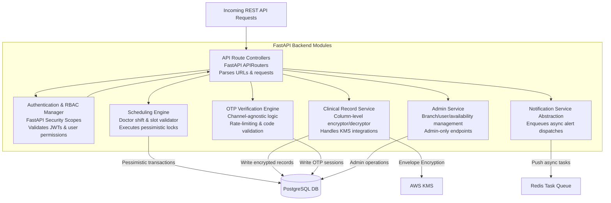
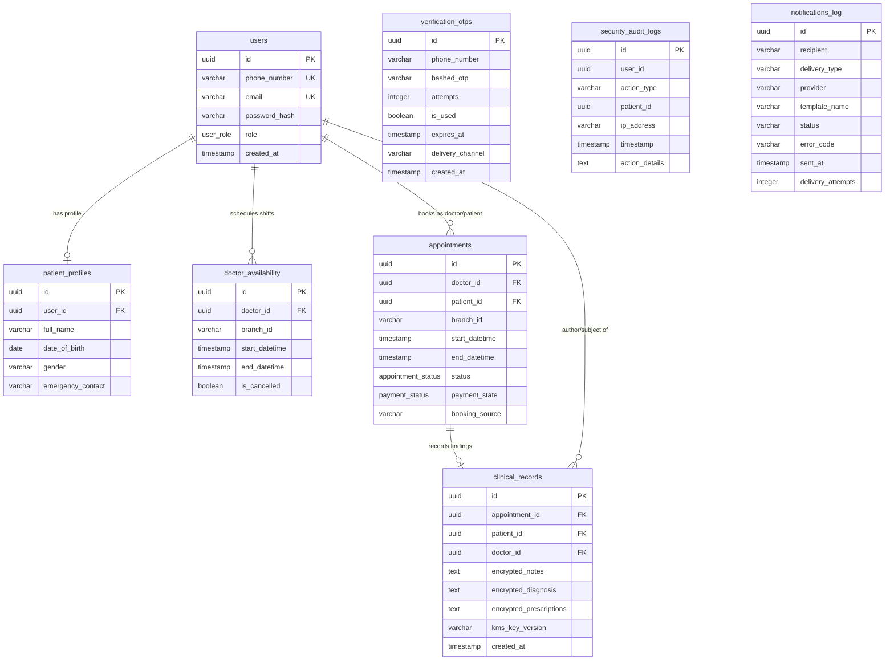

# C4 Level 3 — Component Diagram (FastAPI Backend)

**Source**: C4 Architecture Models (2026-06-04)

---

## FastAPI Backend Components

| Component | Technology | Responsibility |
|---|---|---|
| API Route Controllers | FastAPI APIRouters | Parses URLs & incoming requests; dispatches to services |
| Authentication & RBAC Manager | FastAPI Security Scopes | Validates JWTs; enforces user role permissions |
| Scheduling Engine | Python / SQLAlchemy | Doctor shift & slot validator; executes pessimistic locks |
| Clinical Record Service | Python / AWS KMS SDK | Column-level AES-256-GCM encryptor/decryptor; handles KMS integration |
| OTP Verification Engine | Python | Channel-agnostic OTP logic; rate-limiting & code validation |
| Notification Service Abstraction | Python / Celery | Enqueues async alert dispatches; implements Strategy Pattern failover |
| Admin Service | FastAPI APIRouter | Branch/user/availability management; admin-only endpoints |

---

## Component Flow

```
Incoming REST API Request
        ↓
[API Route Controllers]
        ↓
[Auth & RBAC Manager] ←→ [API Route Controllers]
        ↓
┌──────────────────────────────────────────┐
│  [Scheduling Engine]                     │──→ [PostgreSQL] (pessimistic locks)
│  [Clinical Record Service]               │──→ [AWS KMS] + [PostgreSQL]
│  [OTP Verification Engine]               │──→ [PostgreSQL]
│  [Notification Publisher]                │──→ [Redis Queue]
│  [Admin Service]                         │──→ [PostgreSQL]
└──────────────────────────────────────────┘
```

---

## Component Diagram (Mermaid)



---

# C4 Level 4 — Database ERD

## Entities

| Table | Classification | Key Fields |
|---|---|---|
| `users` | Auth (unencrypted) | id (PK), phone_number (UK), email (UK), password_hash, role |
| `patient_profiles` | Confidential (NDPR) | id (PK), user_id (FK), full_name, date_of_birth, gender |
| `doctor_availability` | Internal | id (PK), doctor_id (FK), branch_id, start_datetime, end_datetime, is_cancelled |
| `appointments` | Internal | id (PK), doctor_id (FK), patient_id (FK), branch_id, start/end_datetime, status, payment_state, booking_source |
| `clinical_records` | Restricted (Medical) — Encrypted | id (PK), appointment_id (FK), patient_id (FK), doctor_id (FK), encrypted_notes, encrypted_diagnosis, encrypted_prescriptions, kms_key_version |
| `verification_otps` | Internal | id (PK), phone_number, hashed_otp, attempts, is_used, expires_at, delivery_channel |
| `security_audit_logs` | Internal (Immutable) | id (PK), user_id, action_type, patient_id, ip_address, timestamp, action_details |
| `notifications_log` | Internal | id (PK), recipient, delivery_type, provider, template_name, status, error_code, sent_at, delivery_attempts |

## Key Relationships

- `users` 1 → 0..1 `patient_profiles`
- `users` 1 → 0..* `doctor_availability` (as doctor)
- `users` 1 → 0..* `appointments` (as doctor or patient)
- `appointments` 1 → 0..1 `clinical_records`
- `users` 1 → 0..* `clinical_records` (as author/subject)

## ERD (Mermaid)

