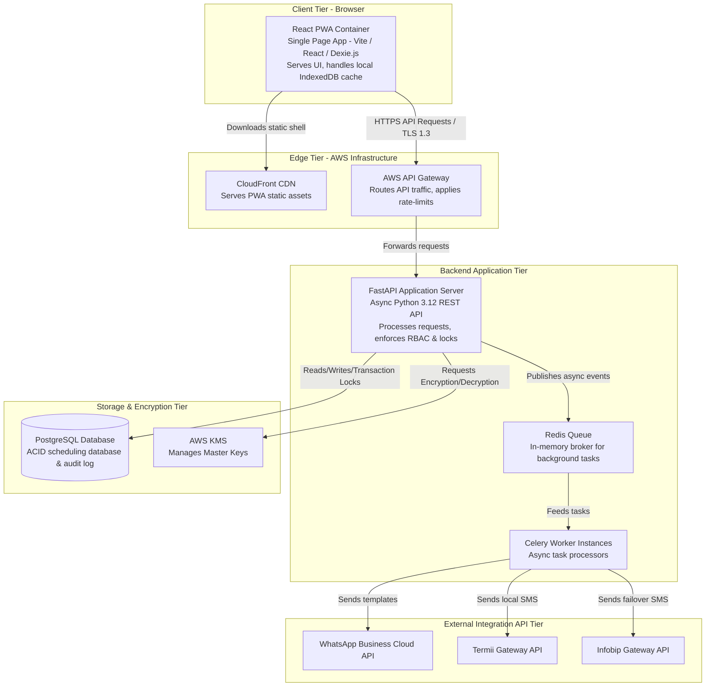

# C4 Level 2 — Container Diagram

**Source**: C4 Architecture Models (2026-06-04)

---

## Containers

| Container | Technology | Responsibility |
|---|---|---|
| React PWA | Vite / React / Dexie.js | SPA client; serves UI; manages local IndexedDB offline cache |
| CloudFront CDN | AWS CloudFront | Serves PWA static assets from edge locations |
| AWS API Gateway | AWS API Gateway | Routes API traffic, applies rate limits |
| FastAPI Application Server | FastAPI, Python 3.12, async | Processes requests; enforces RBAC and pessimistic locks |
| Celery Worker Instances | Celery + Python | Async background task processors (notifications, OTP delivery) |
| Redis Queue | Redis | In-memory broker for background task queuing |
| PostgreSQL Database | PostgreSQL 16+ (AWS RDS) | ACID scheduling database, audit logs, clinical records |
| AWS KMS | AWS Key Management Service | Manages master encryption keys for clinical data |
| WhatsApp Business Cloud API | External | Transactional WhatsApp message delivery |
| Termii Gateway API | External | Primary Nigerian SMS delivery (DND-bypass) |
| Infobip Gateway API | External | Secondary/fallback SMS delivery |

---

## Dependency Flow

```
[Patient Browser / Staff Workstation]
        ↓ HTTPS / TLS 1.3
[CloudFront CDN] ──→ [React PWA (browser)]
        ↓ HTTPS API requests
[AWS API Gateway]
        ↓
[FastAPI Application Server]
    ├──→ [PostgreSQL] (reads/writes/pessimistic locks)
    ├──→ [AWS KMS] (encrypt/decrypt clinical records)
    └──→ [Redis Queue]
              ↓
        [Celery Workers]
            ├──→ [WhatsApp API] (primary)
            ├──→ [Termii API] (SMS failover)
            └──→ [Infobip API] (SMS backup)
```

---

## Container Diagram (Mermaid)


