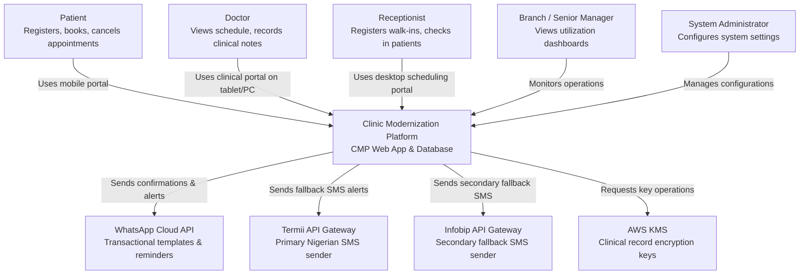

# C4 Level 1 — System Context

**Source**: C4 Architecture Models (2026-06-04)

---

## System Boundary

**Clinic Modernization Platform (CMP)** — Web app + database serving all clinic operations.

---

## Users (People)

| Actor | Interaction |
|---|---|
| Patient | Mobile portal — registers, books, cancels appointments |
| Doctor | Clinical portal (tablet/PC) — views schedule, records clinical notes |
| Receptionist | Desktop scheduling portal — registers walk-ins, checks in patients |
| Branch / Senior Manager | Monitoring portal (laptop) — views utilization dashboards |
| System Administrator | Admin console — manages configurations, branches, roles |

---

## External Systems

| System | Purpose | Protocol |
|---|---|---|
| WhatsApp Cloud API | Transactional templates & appointment reminders | REST API (Outbound) |
| Termii API Gateway | Primary Nigerian SMS sender (DND-bypass) | REST API (Outbound) |
| Infobip API Gateway | Secondary fallback SMS sender | REST API (Outbound) |
| AWS KMS | Clinical record encryption key management | AWS SDK (Outbound) |

---

## Key Relationships

- All user roles → CMP via HTTPS browser sessions
- CMP → WhatsApp, Termii, Infobip (outbound notifications via async workers)
- CMP → AWS KMS (encrypt/decrypt clinical records)

---

## System Diagram (Mermaid)

