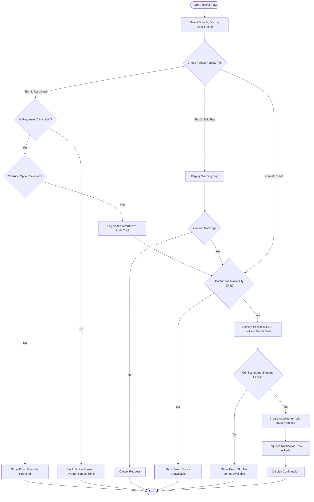
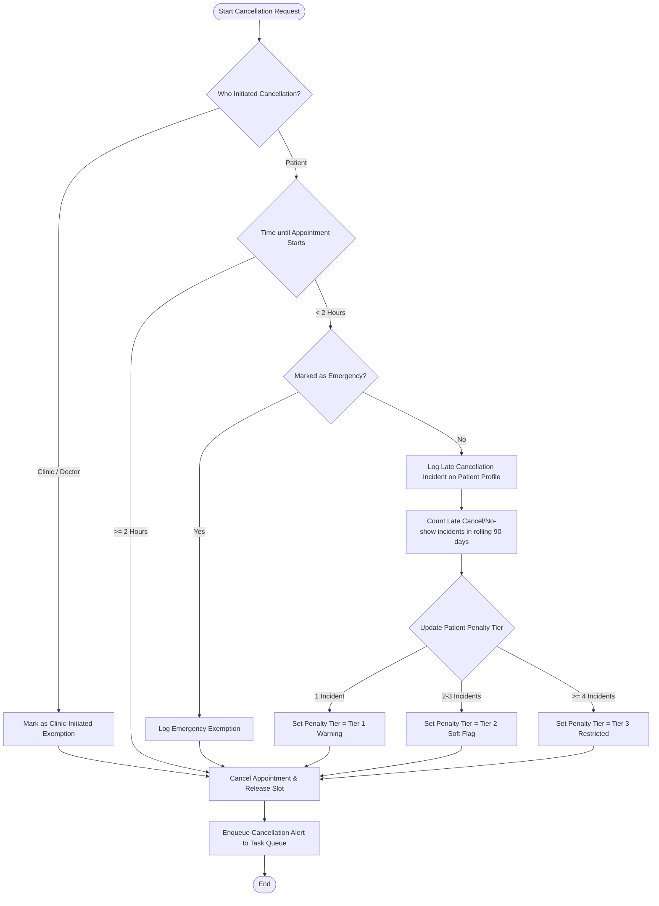

# UML Activity Diagrams

## 1. Booking Request & Restriction Validation Flow

Details the step-by-step control logic executed by the scheduling engine when a booking request arrives (**FR-003**, **FR-015**, **FR-019** of [Product Requirements](file:///C:/Users/DELL/Documents/Project/cmp/knowledge/product/requirements.md)).

---

## 2. Cancellation Penalty Engine Control Flow

Details the business rules processed by the system when an appointment is cancelled (**FR-012** to **FR-017** of [Product Requirements](file:///C:/Users/DELL/Documents/Project/cmp/knowledge/product/requirements.md)).

