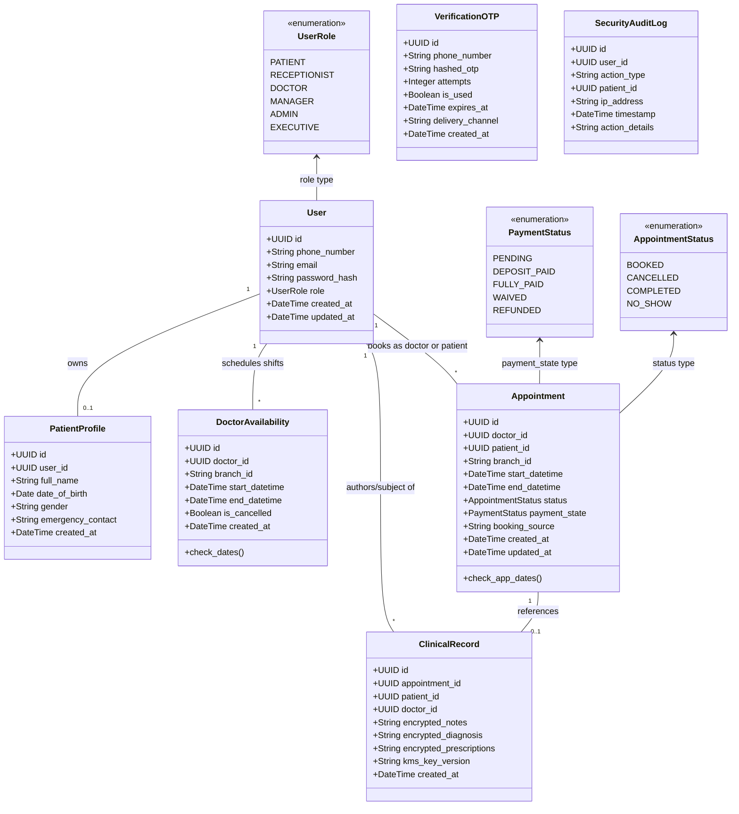

# UML Class Diagrams

## Static Entity Domain Model

This diagram represents the database schema and system entities specified in the [Data Models](file:///C:/Users/DELL/Documents/Project/cmp/knowledge/system/data-models.md) and [Product Requirements](file:///C:/Users/DELL/Documents/Project/cmp/knowledge/product/requirements.md) (specifically **DR-004**).

