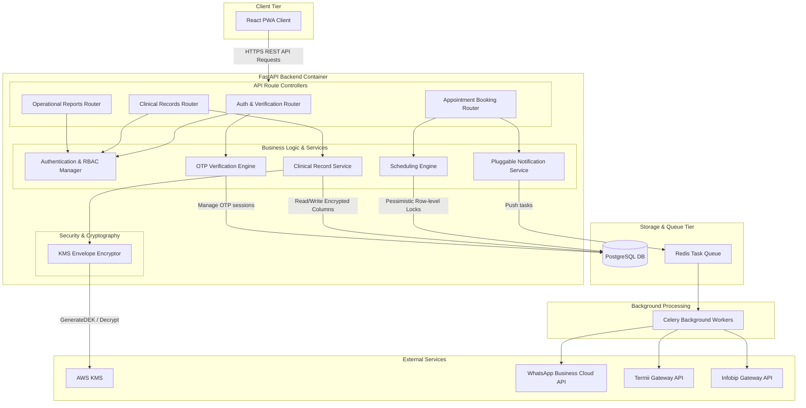

# UML Component Diagrams

## FastAPI Backend Architecture

Decomposes the logical architecture of the **FastAPI Container** based on the Level 3 Component Diagram of the [C4 Components](file:///C:/Users/DELL/Documents/Project/cmp/knowledge/architecture/C4/components.md) and design choices in [ADR-003](file:///C:/Users/DELL/Documents/Project/cmp/knowledge/architecture/ADR/ADR-003-application-level-column-encryption.md) and [ADR-004](file:///C:/Users/DELL/Documents/Project/cmp/knowledge/architecture/ADR/ADR-004-pluggable-notification-failover.md).

