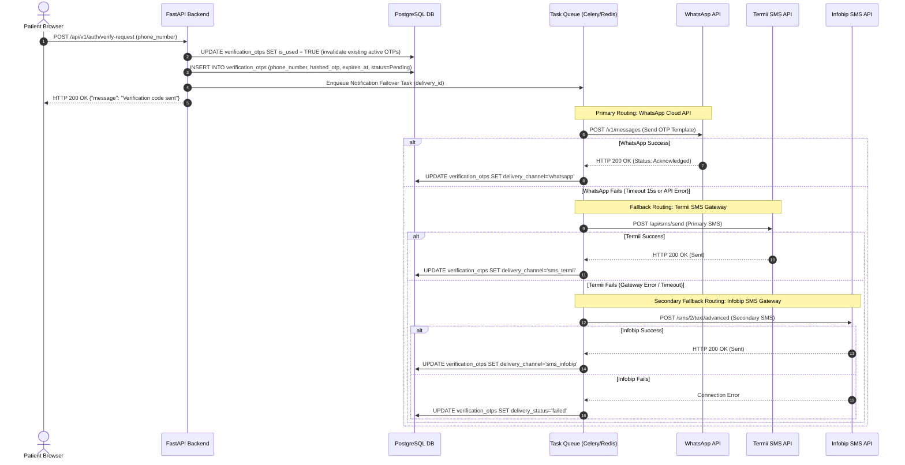
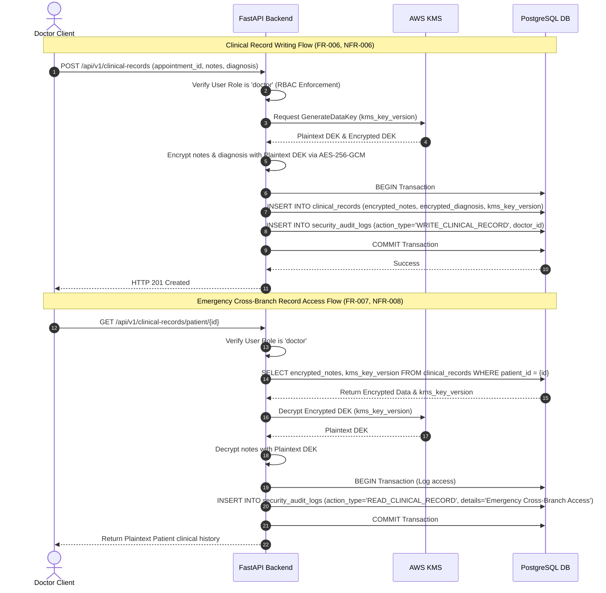

# UML Sequence Diagrams

## 1. Doctor Shift Validation & Concurrent Booking (Pessimistic Locking)

Illustrates how the database pessimistic locking mechanism (**FR-019**, **NFR-001** of [Product Requirements](file:///C:/Users/DELL/Documents/Project/cmp/knowledge/product/requirements.md)) handles two concurrent requests trying to book the exact same doctor time-slot.

```mermaid
sequenceDiagram
    autonumber
    actor PatientA as Patient A Client
    actor PatientB as Patient B Client
    participant API as FastAPI Backend
    participant DB as PostgreSQL DB

    Note over PatientA, DB: Concurrent booking requests for Dr. X at Monday 9:00 AM
    PatientA->>API: POST /api/v1/appointments (Dr. X, 9:00 AM)
    PatientB->>API: POST /api/v1/appointments (Dr. X, 9:00 AM)

    critical Transaction A starts
        API->>DB: BEGIN Transaction A
        API->>DB: SELECT DoctorAvailability with_for_update() (Dr. X, Monday 9 AM - 9:30 AM)
        activate DB
        Note over DB: Lock acquired for Transaction A on DoctorAvailability row
    and Transaction B starts
        API->>DB: BEGIN Transaction B
        API->>DB: SELECT DoctorAvailability with_for_update() (Dr. X, Monday 9 AM - 9:30 AM)
        Note over DB: Transaction B BLOCKED, waiting for Lock on DoctorAvailability row
    end

    API->>DB: SELECT Appointments with_for_update() (Dr. X, Monday 9:00 AM)
    DB-->>API: No conflicting appointments found
    API->>DB: INSERT INTO appointments (Dr. X, Patient A, booked)
    API->>DB: COMMIT Transaction A
    deactivate DB
    Note over DB: Lock released. Transaction A committed.

    activate DB
    Note over DB: Transaction B unblocks, lock acquired by Transaction B
    DB-->>API: Returns DoctorAvailability shift data
    API->>DB: SELECT Appointments with_for_update() (Dr. X, Monday 9:00 AM)
    DB-->>API: Conflict found (Appointment for Patient A exists)
    API->>DB: ROLLBACK Transaction B
    deactivate DB
    Note over DB: Lock released. Transaction B rolled back.
    API-->>PatientA: HTTP 201 Created (Appointment ID)
    API-->>PatientB: HTTP 409 Conflict ("Slot is no longer available")
```

---

## 2. Hierarchical Verification & OTP Delivery Flow (WhatsApp-First, SMS Fallback)

Visualizes the multi-gateway verification flow (**OQ-002**, **INT-004** of [Product Requirements](file:///C:/Users/DELL/Documents/Project/cmp/knowledge/product/requirements.md)) attempting delivery via WhatsApp, falling back to local Termii SMS, and backing up to Infobip, as decided in [ADR-004](file:///C:/Users/DELL/Documents/Project/cmp/knowledge/architecture/ADR/ADR-004-pluggable-notification-failover.md).



---

## 3. Clinical Consultation Logging & Audited Record Access

Represents the cryptographic workflow (**FR-006**, **FR-007**, **NFR-006**, **NFR-007**, **NFR-008** of [Product Requirements](file:///C:/Users/DELL/Documents/Project/cmp/knowledge/product/requirements.md)) for writing encrypted records and logging emergency overrides, governed by [ADR-003](file:///C:/Users/DELL/Documents/Project/cmp/knowledge/architecture/ADR/ADR-003-application-level-column-encryption.md).


