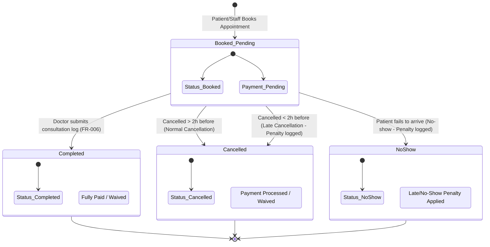

# UML State Diagrams

## 1. Appointment & Payment State Machine

Maps out status and payment transitions for the main scheduling unit (**DR-004**, **INT-005** of [Product Requirements](file:///C:/Users/DELL/Documents/Project/cmp/knowledge/product/requirements.md)).



---

## 2. Patient Penalty & Booking Restriction Lifecycle

Shows how late cancellations and no-shows affect patient booking permissions in rolling 90-day windows (**FR-012**, **FR-013**, **FR-014** of [Product Requirements](file:///C:/Users/DELL/Documents/Project/cmp/knowledge/product/requirements.md)).

```mermaid
stateDiagram-v2
    [*] --> Normal : New Patient Account Registered
    
    Normal --> Tier1_Warning : 1st Late Cancel / No-show
    Tier1_Warning --> Tier2_SoftFlag : 2nd-3rd Late Cancel / No-show
    Tier2_SoftFlag --> Tier3_Restricted : >= 4th Late Cancel / No-show
 
    Tier3_Restricted --> Tier2_SoftFlag : rolling 90 days elapse for older incidents
    Tier2_SoftFlag --> Tier1_Warning : rolling 90 days elapse for older incidents
    Tier1_Warning --> Normal : rolling 90 days elapse for older incidents

    state Normal {
        Note: Full self-service online booking enabled
    }
    state Tier1_Warning {
        Note: Warning banner shown on booking/cancellation screen
    }
    state Tier2_SoftFlag {
        Note: Soft flag on profile; requires confirmation to schedule
    }
    state Tier3_Restricted {
        Note: Online booking BLOCKED. Requires receptionist manual override.
    }
```
